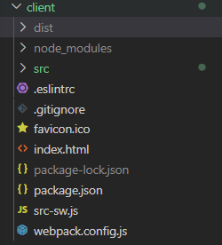
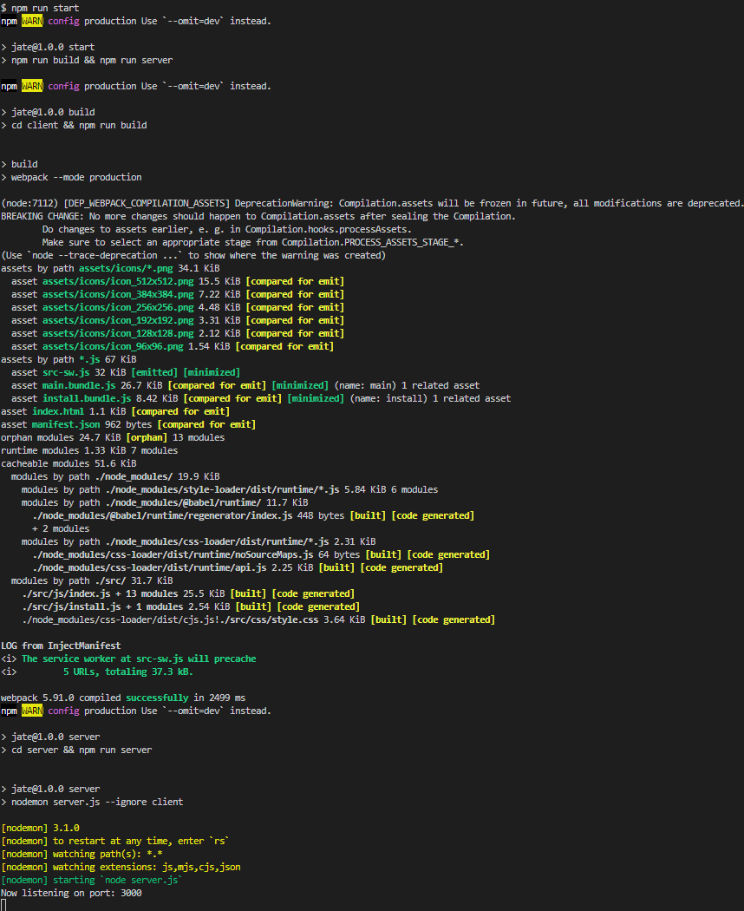
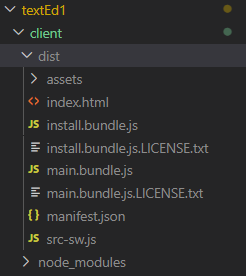
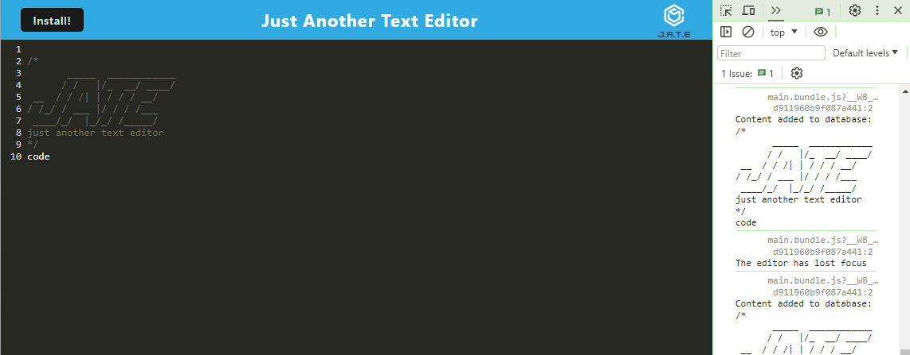
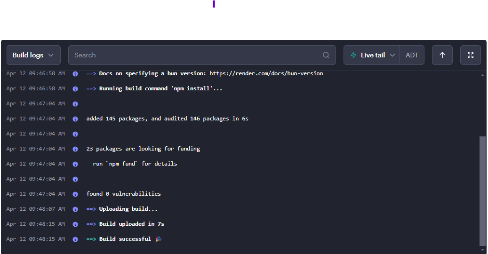
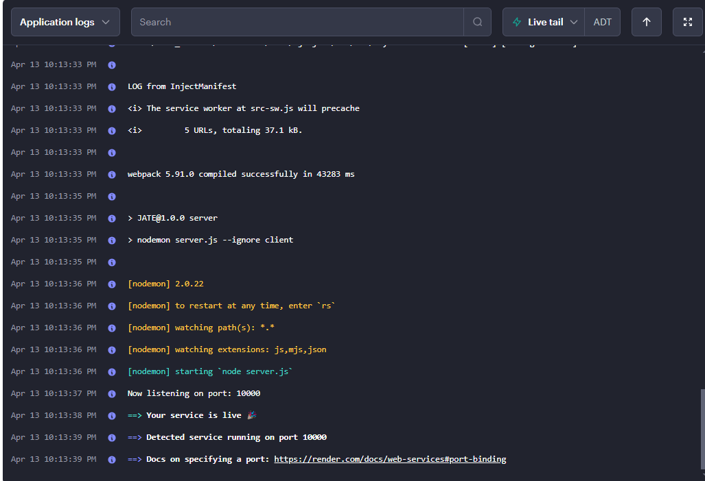

# textEd

# Description
Progressive Web Applications (PWA) Challenge: Text Editor

- [Getting Started](#getting-started)
- [User Story](#user-story)
- [Acceptance Criteria](#acceptance-criteria)
- [Demo](#Demo)
- [Built-With](#built-with)
- [Collaboration](#collaboration)
- [Deployment](#deployment)
- [License](#license)

# Getting Started

1. Clone GitHub Repository
2. npm run install 
3. npm run start

# User Story

AS A developer

I WANT to create notes or code snippets with or without an internet connection

SO THAT I can reliably retrieve them for later use

# Acceptance Criteria

GIVEN a text editor web application

WHEN I open my application in my editor

THEN I should see a client server folder structure

WHEN I run npm run start from the root directory

THEN I find that my application should start up the backend and serve the client

WHEN I run the text editor application from my terminal

THEN I find that my JavaScript files have been bundled using webpack

WHEN I run my webpack plugins

THEN I find that I have a generated HTML file, service worker, and a manifest file

WHEN I use next-gen JavaScript in my application

THEN I find that the text editor still functions in the browser without errors

WHEN I open the text editor

THEN I find that IndexedDB has immediately created a database storage

WHEN I enter content and subsequently click off of the DOM window

THEN I find that the content in the text editor has been saved with IndexedDB

WHEN I reopen the text editor after closing it

THEN I find that the content in the text editor has been retrieved from our IndexedDB

WHEN I click on the Install button

THEN I download my web application as an icon on my desktop

WHEN I load my web application

THEN I should have a registered service worker using workbox

WHEN I register a service worker

THEN I should have my static assets pre cached upon loading along with subsequent pages and static assets

# Demo

<video controls src="client/src/images/JATEDEMO.mp4" title="Title"></video>

WHEN I deploy to Render

THEN I should have proper build scripts for a webpack application

# Built-With

-Bootcamp Spot Module 19

-Render

-IndexedDB API

-manifest.json

-WebpackPwaManifest

-npm express, webpack-dev-server, babel,css-loader,concurrently

-mdn web docs_ IndexedDB API and manifest.json

-stackoverflow.com multiple package install

# Collaboration

-Help from Ask BCS Learning Assistant-ask-306835 (japb1998) with dependancy fix!

-Help debugging from classmate Samantha Allen over slack <3

This is NOT an open source project

# Deployment
Render Deploymnet Link: [Click Here!](https://texted1.onrender.com/)

GitHub Repo Link: [Click Here!](https://github.com/SamGreenwood84/textEd1.git)

# License
MIT License

Copyright (c) 2024 SamGreenwood

# Version 5